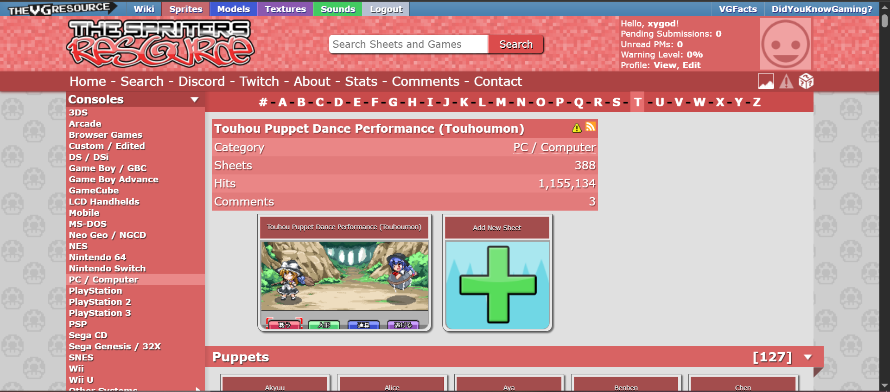
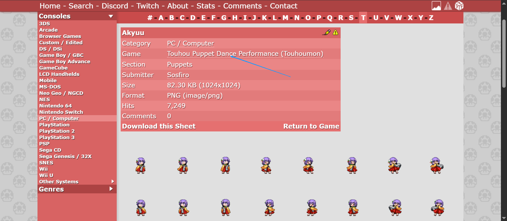

# 运行前提

[node.js](https://nodejs.org/en)

# 这是什么

这是 [vg-resource 的下载器](https://www.vg-resource.com/)，支持 sprites、models、textures 和 sounds 资源的下载

# 使用方法（例子）

1. 进入一个 GAME 资源合集，是类似这样一个页面：
   
   一般是从这里进入
   
   然后复制网页地址：https://www.sounds-resource.com/pc_computer/enadreambbq/
2. 打开 cmd 命令行，输入

```sh
$ node index.js https://www.sounds-resource.com/pc_computer/enadreambbq/
```

```sh
$ node index.js 网页地址
```

**只需要网页地址即可下载，下载器会自动爬取网页内容并根据资源类型进行分类，大致目录结构如下：out-spriters-游戏合集**
